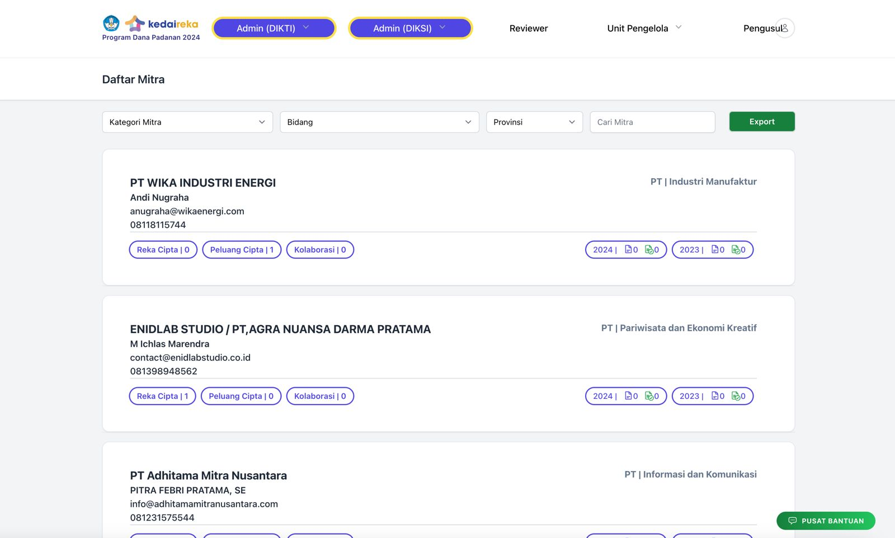
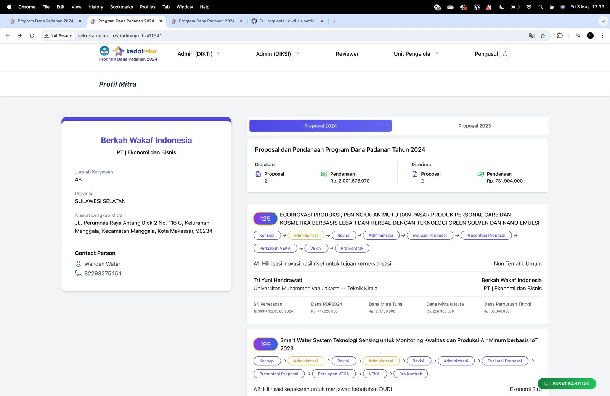
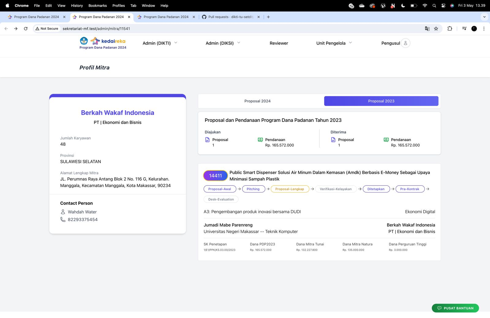

# Dokumentasi Teknis

### DAFTAR MITRA&#x20;

(andre)

**`DOKUMENTASI`**

<figure><figcaption>
Tampilan Daftar Mitra
</figcaption></figure>

<figure><figcaption>
Proposal 2024
</figcaption></figure>

<figure><figcaption>
Proposal 2023
</figcaption></figure>

**`MODEL`**

2023

<table><thead><tr><th width="75">No</th><th width="288">Model</th><th>Nama Tabel</th></tr></thead><tbody><tr><td>1</td><td>tkaiIndustry</td><td>tkai_profile_industry</td></tr><tr><td>2</td><td>tkaiProposal</td><td>tkai_matching_fund</td></tr><tr><td>3</td><td></td><td>
anggaran_bahan_prototype

anggaran_bantuan_insentif_mahasiswa

anggaran_biaya_perjalanan

anggaran_fgd

anggaran_honorerium

anggaran_pendaftaran_hki

anggaran_pendampingan

anggaran_pengelolaan_program

anggaran_pengujian_produk

anggaran_peralatan_pendukung

anggaran_produk_skala_terbatas

anggaran_survey
</td></tr><tr><td>4</td><td>tx_proposal_status</td><td>tx_proposal_status</td></tr></tbody></table>

2024

<table><thead><tr><th width="79">No</th><th width="288">Model</th><th>Nama Tabel</th></tr></thead><tbody><tr><td>1</td><td>mf_proposal </td><td>mf_proposals</td></tr><tr><td>2</td><td>mf_proposal_anggaran</td><td>mf_proposal_anggarans</td></tr><tr><td>3</td><td></td><td>
mf_proposal_statuses

mf_proposal_penetapans
</td></tr></tbody></table>

**`RELASI`**

Tkai\_industry has many Tkai\_matching\_fund (Proposal 2023)

Tkai\_industry has many Mf\_Proposals (Proposal 2024)

Mf\_Proposals has many Mf\_Proposal\_anggarans (Anggaran2024)

Tkai\_matching\_fund has many anggaran\_bahan\_prototype, anggaran\_bantuan\_insentif\_mahasiswa, anggaran\_biaya\_perjalanan, anggaran\_fgd, anggaran\_honorerium, anggaran\_pendaftaran\_hki, anggaran\_pendampingan, anggaran\_pengelolaan\_program, anggaran\_pengujian\_produk, anggaran\_pendukung, anggaran\_produk\_skala\_terbatas, anggaran\_survey, (Anggaran2023)

Mf\_Proposals has one  mf\_proposal\_penetapans (sk penetapan dan anggaran ditetapkan2024)

tkai\_matching\_fund has one proposal\_ditetapkan (sk penetapan dan anggaran ditetapkan2023)

`NAMA KOMPONEN`

<table><thead><tr><th width="79">No</th><th width="288">Nama Folder</th><th>Nama File</th></tr></thead><tbody><tr><td>1</td><td>komponen/mitra/</td><td>list_proposal2023, list_proposal2024</td></tr><tr><td>2</td><td><strong>index</strong> </td><td>show</td></tr><tr><td>3</td><td></td><td></td></tr></tbody></table>

### LIST INNOVATOR

(Mervin)

**`DOKUMENTASI`**

<figure><figcaption>
Tampilan List Innovator
</figcaption></figure>

<figure><figcaption>
Tampilan Detail Innovator
</figcaption></figure>

<figure><figcaption></figcaption></figure>

<figure><figcaption>
Filter Innovator
</figcaption></figure>

<figure><figcaption>
Filter Perguruan Tinggi
</figcaption></figure>

<figure><figcaption>
Filter
</figcaption></figure>

**`MODEL`**

<table><thead><tr><th width="75">No</th><th width="288">Model</th><th width="258">Nama Tabel</th><th></th></tr></thead><tbody><tr><td>1</td><td>TkaiInnovator</td><td>tkai_profile_innovator(tkai)</td><td></td></tr><tr><td>2</td><td>MfProposal (24)</td><td>mf_proposals</td><td></td></tr><tr><td>3</td><td>MfProposalPenetapan (24)</td><td>mf_proposal_penetapans</td><td></td></tr><tr><td>4</td><td>TkaiProposal(23)</td><td>tkai_matching_fund</td><td></td></tr><tr><td>5</td><td>ProposalDitetapkan</td><td>proposal_ditetapkans</td><td></td></tr><tr><td>6</td><td>TkaiPerguruanTinggi</td><td>tkai_master_pt</td><td></td></tr></tbody></table>

**`RELASI`**

tkai\_profile\_innovator belongs to tkai\_user&#x20;

tkai\_profile\_innovator has manny mf\_proposals&#x20;

mf\_proposals has one mf\_proposal\_penetapans

Mf\_Proposals has many Mf\_Proposal\_anggarans (Anggaran2024)

Tkai\_matching\_fund has many anggaran\_bahan\_prototype, anggaran\_bantuan\_insentif\_mahasiswa, anggaran\_biaya\_perjalanan, anggaran\_fgd, anggaran\_honorerium, anggaran\_pendaftaran\_hki, anggaran\_pendampingan, anggaran\_pengelolaan\_program, anggaran\_pengujian\_produk, anggaran\_pendukung, anggaran\_produk\_skala\_terbatas, anggaran\_survey, (Anggaran2023)

Tkai\_matching\_fund has one proposal\_ditetapkans

`NAMA KOMPONEN`

<table><thead><tr><th width="79">No</th><th width="288">Nama Folder</th><th>Nama File</th></tr></thead><tbody><tr><td>1</td><td>innovator</td><td>index</td></tr></tbody></table>

**Keanggotaan Proposal**

**`DOKUMENTASI`**

<figure><figcaption></figcaption></figure>

tkai\_profile\_innovator

**`MODEL`**

<table><thead><tr><th width="87">No</th><th width="288">Model</th><th>Nama Tabel</th></tr></thead><tbody><tr><td>1</td><td>MfProposal</td><td>mf_proposals</td></tr></tbody></table>

**`RELASI`**

tkai\_profile\_innovator belongs to tkai\_user&#x20;

mf\_proposals belong to many tkai\_profile\_innovator

mf\_proposals belong to tkai\_profile\_industry

Mf\_Proposals has many Mf\_Proposal\_anggotas (Anggota2024)

`NAMA KOMPONEN`

<table><thead><tr><th width="79">No</th><th width="288">Nama Folder</th><th>Nama File</th></tr></thead><tbody><tr><td>1</td><td>pengusul2024</td><td>keanggotaan-proposal</td></tr><tr><td>2</td><td></td><td></td></tr><tr><td>3</td><td></td><td></td></tr></tbody></table>

### DETAIL INNOVATOR

(Reza)

**`DOKUMENTASI`**

<figure><figcaption></figcaption></figure>

<figure><figcaption></figcaption></figure>

<figure><figcaption></figcaption></figure>

**`MODEL`**

2023

<table><thead><tr><th width="75">No</th><th width="288">Model</th><th>Nama Tabel</th></tr></thead><tbody><tr><td>1</td><td>TkaiInnovator</td><td>tkai_profile_innovator</td></tr><tr><td>2</td><td>MfProposal(24)</td><td>mf_proposals</td></tr><tr><td></td><td>MfProposalStatus(24)</td><td>mf_proposal_statuses</td></tr><tr><td>3</td><td>TkaiProposal</td><td>tkai_matching_fund</td></tr><tr><td></td><td>TxProposalStatus</td><td>tx_proposal_status</td></tr><tr><td>4</td><td>TkaiInnovation</td><td>tkai_innovation</td></tr><tr><td>5</td><td>TkaiBusinessCase </td><td>tkai_business_case</td></tr></tbody></table>

2024

<table><thead><tr><th width="79">No</th><th width="288">Model</th><th>Nama Tabel</th></tr></thead><tbody><tr><td>1</td><td>MfProposal</td><td></td></tr></tbody></table>

**`RELASI`**

TkaiInnovator belongs To TkaiUser

MfProposal belongs to MfSkema, MfTema, MfBatch, TkaiIndustry

TkaiProposal has one ProposalDitetapkan

TkaiProposal has many TkaiIndustry

TkaiBusinessCase has many TkaiBusinessBid

TkaiBusinessCase belongs to TkaiIndustry

TkaiInnovation has many TkaiInnovationBid

TkaiInnovation belongs to TkaiInnovator

MfProposalStatus belongs to MfProposal

TxProposalStatus belong to TkaiProposal

`NAMA KOMPONEN`

<table><thead><tr><th width="79">No</th><th width="288">Nama Folder</th><th>Nama File</th></tr></thead><tbody><tr><td>1</td><td>Innovator</td><td>Dashboard.php</td></tr><tr><td>2</td><td>Innovator</td><td>Sidebar.php</td></tr><tr><td>3</td><td>Komponen/Innovator</td><td>DaftarKolaborasi.php, DaftarProposal.php, Kolaborasi.php, Proposal2023.php</td></tr><tr><td>4</td><td>Komponen/Proposal2023</td><td>Status2023.php</td></tr></tbody></table>

### USER MITRA

(Umar)

**`DOKUMENTASI`**

<figure><figcaption></figcaption></figure>

<figure><figcaption></figcaption></figure>

<figure><figcaption></figcaption></figure>

**`MODEL`**

<table><thead><tr><th width="79">No</th><th width="288">Model</th><th width="244">Nama Tabel</th><th></th></tr></thead><tbody><tr><td>1</td><td>TkaiUser</td><td>tkai_user</td><td></td></tr><tr><td>2</td><td>User</td><td>tkai_bo_user</td><td></td></tr><tr><td>3</td><td>TkaiIndustry</td><td>tkai_profile_industry</td><td></td></tr><tr><td>4</td><td>TkaiInnovator</td><td>tkai_profile_innovator</td><td></td></tr><tr><td>5</td><td>TkaiProposal</td><td>tkai_matching_fund</td><td></td></tr><tr><td>6</td><td>ProposalDitetapkan</td><td>proposal_ditetapkans</td><td></td></tr><tr><td>7</td><td>MfProposal</td><td>mf_proposals</td><td></td></tr><tr><td>8</td><td>TxProposalStatus</td><td>tx_proposal_status</td><td></td></tr><tr><td>9</td><td>MfProposalAnggaran</td><td>mf_proposal_anggarans</td><td></td></tr><tr><td>10</td><td>MfProposalPenetapan</td><td>mf_proposal_penetapans</td><td></td></tr><tr><td>11</td><td>AnggaranHonorarium</td><td>anggaran_honorarium</td><td></td></tr><tr><td>12</td><td>AnggaranPeralatanPendukung</td><td>anggaran_peralatan_pendukung</td><td></td></tr><tr><td>13</td><td>AnggaranBahanPrototype</td><td>anggaran_bahan_prototype</td><td></td></tr><tr><td>14</td><td>AnggaranPendampingan</td><td>anggaran_pendampingan</td><td></td></tr><tr><td>15</td><td>AnggaranFGD</td><td>anggaran_fgd</td><td></td></tr><tr><td>16</td><td>AnggaranSurvey</td><td>anggaran_survey</td><td></td></tr><tr><td>17</td><td>AnggaranPengujianProduk</td><td>anggaran_pengujian_produk</td><td></td></tr><tr><td>18</td><td>AnggaranPendaftaranHKI</td><td>anggaran_pendaftaran_hki</td><td></td></tr><tr><td>19</td><td>AnggaranBiayaPerjalananDinas</td><td>anggaran_biaya_perjalanan</td><td></td></tr><tr><td>20</td><td>AnggaranBantuanInsentifMahasiswa</td><td>anggaran_bantuan_insentif_mahasiswa</td><td></td></tr><tr><td>21</td><td>AnggaranProdukSkalaTerbatas</td><td>anggaran_produk_skala_terbatas</td><td></td></tr><tr><td>22</td><td>AnggaranPengelolaanProgram</td><td>anggaran_pengelolaan_program</td><td></td></tr></tbody></table>

**`RELASI`**

tkai\_profile\_industry belongs to tkai\_user

tkai\_profile\_industry has many tkai\_matching\_fund

tkai\_profile\_innovator belongs to tkai\_user&#x20;

tkai\_profile\_innovator has many mf\_proposals&#x20;

mf\_proposals has one mf\_proposal\_penetapans

mf\_proposals has many mf\_proposal\_anggarans (Anggaran2024)

tkai\_matching\_fund belongs to tkai\_profile\_industry

tkai\_matching\_fund has one proposal\_ditetapkans

tkai\_matching\_fund has many anggaran\_honorarium

tkai\_matching\_fund has many anggaran\_peralatan\_pendukung

tkai\_matching\_fund has many anggaran\_bahan\_prototype

tkai\_matching\_fund has many anggaran\_pendampingan

tkai\_matching\_fund has many anggaran\_fgd

tkai\_matching\_fund has many anggaran\_survey

tkai\_matching\_fund has many anggaran\_pengujian\_produk

tkai\_matching\_fund has many anggaran\_pendaftaran\_hki

tkai\_matching\_fund has many anggaran\_biaya\_perjalanan

tkai\_matching\_fund has many anggaran\_bantuan\_insentif\_mahasiswa

tkai\_matching\_fund has many anggaran\_produk\_skala\_terbatas

tkai\_matching\_fund has many anggaran\_pengelolaan\_program

`NAMA KOMPONEN`

<table><thead><tr><th width="79">No</th><th width="288">Nama Folder</th><th>Nama File</th></tr></thead><tbody><tr><td>1</td><td>Mitra/User</td><td>ProfileMitra.php</td></tr><tr><td>2</td><td>Mitra/User</td><td>ProposalMitra.php</td></tr><tr><td>3</td><td>Mitra/User</td><td>ProposalMitra2023.php</td></tr><tr><td>4</td><td>Komponen/Mitra/User</td><td>ProfileCard.php</td></tr><tr><td>5</td><td>Komponen/Mitra/User</td><td>PendanaanProposal.php</td></tr><tr><td>6</td><td>Komponen/Mitra/User</td><td>ListProposal.php</td></tr><tr><td>7</td><td>Komponen/Mitra/User/Proposal</td><td>Proposal2023.php</td></tr><tr><td>8</td><td>Komponen/Mitra/User/Proposal</td><td>Proposal2024.php</td></tr></tbody></table>

###

### UNIT PENGELOLA

(Bintang)

**`DOKUMENTASI`**

**`MODEL`**

<table><thead><tr><th width="75">No</th><th width="288">Model</th><th>Nama Tabel</th></tr></thead><tbody><tr><td>1</td><td>TkaiInnovator</td><td>tkai_profile_innovator</td></tr><tr><td>2</td><td>MfProposal(24)</td><td>mf_proposals</td></tr><tr><td>3</td><td>MfProposalStatus(24)</td><td>mf_proposal_statuses</td></tr><tr><td>4</td><td>TkaiProposal</td><td>tkai_matching_fund</td></tr><tr><td>5</td><td>TxProposalStatus</td><td>tx_proposal_status</td></tr><tr><td>6</td><td>TkaiInnovation</td><td>tkai_innovation</td></tr><tr><td>7</td><td>TkaiMitra</td><td>tkai_profile_industry</td></tr><tr><td>8</td><td>TkaiProposalDes</td><td>tkai_matching_fund_desc</td></tr><tr><td>9</td><td>ProposalDitetapkan</td><td>tkai_matching_fund</td></tr></tbody></table>

**`RELASI`**

TkaiInnovator belongs To TkaiUser

MfProposal belongs to MfSkema, MfTema, MfBatch, TkaiIndustry

MfProposal belongs to TkaiProfileInnovator, TkaiProfileIndustry

TkaiProposal has one ProposalDitetapkan

TkaiProposal has many TkaiIndustry

TkaiBusinessCase has many TkaiBusinessBid

TkaiBusinessCase belongs to TkaiIndustry

TkaiInnovation has many TkaiInnovationBid

TkaiInnovation belongs to TkaiInnovator

MfProposalStatus belongs to MfProposal (2024)

TxProposalStatus belong to TkaiProposal (2023)

<table><thead><tr><th width="79">No</th><th width="348">Nama Folder</th><th>Nama File</th></tr></thead><tbody><tr><td>1</td><td>Komponen/UnitPengelola/TahunSebelum</td><td>
DaftarProposal2021.php, DaftarProposal2022.php, DaftarProposal2023.php, 

DaftarProposal.php
</td></tr><tr><td></td><td>Livewire/Proposal/TahunSebelumnya</td><td>Status.php, Status2023.php</td></tr><tr><td>2</td><td>Livewire/UnitPengelola/DaftarUsulan/</td><td>Index.php</td></tr></tbody></table>

