# Dokumentasi Teknis

## PENGUSUL

***

### List Innovator

#### **DOKUMENTASI**

<figure>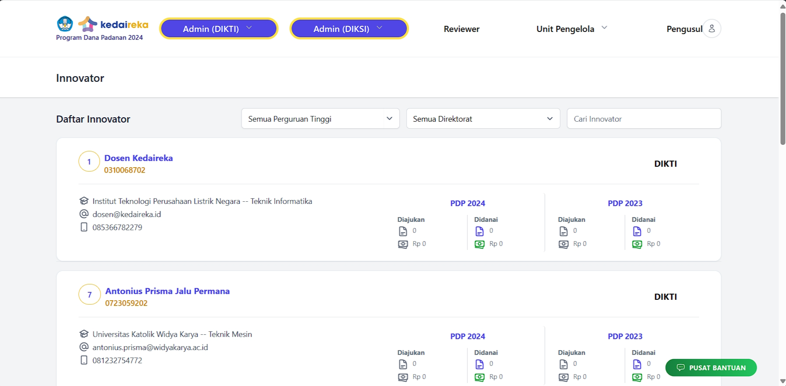<figcaption>
Tampilan List Innovator
</figcaption></figure>

<figure>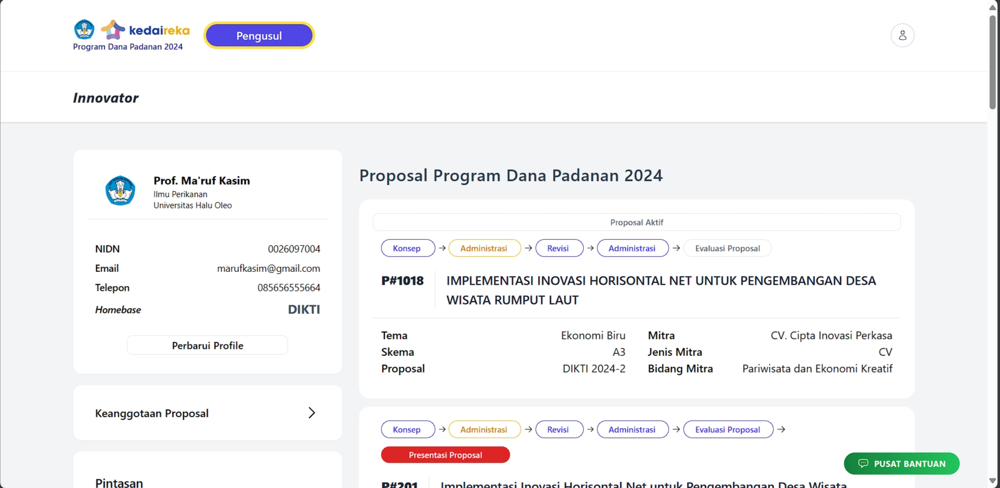<figcaption>
Tampilan Detail Innovator
</figcaption></figure>

<figure>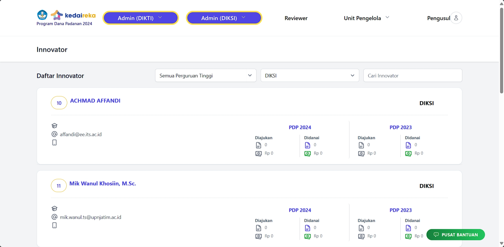<figcaption></figcaption></figure>

<figure>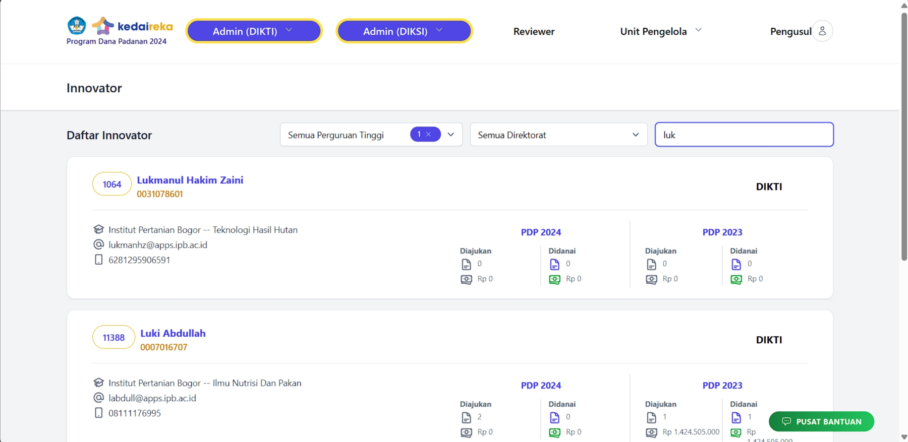<figcaption>
Filter Innovator
</figcaption></figure>

<figure>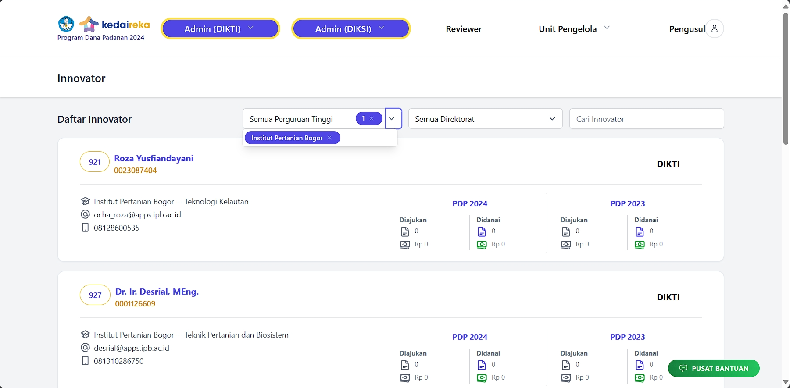<figcaption>
Filter Perguruan Tinggi
</figcaption></figure>

<figure><figcaption>
Filter
</figcaption></figure>

#### **MODEL**

<table><thead><tr><th width="75">No</th><th width="288">Model</th><th width="401">Nama Tabel</th></tr></thead><tbody><tr><td>1</td><td>TkaiInnovator</td><td>tkai_profile_innovator(tkai)</td></tr><tr><td>2</td><td>MfProposal (24)</td><td>mf_proposals</td></tr><tr><td>3</td><td>MfProposalPenetapan (24)</td><td>mf_proposal_penetapans</td></tr><tr><td>4</td><td>TkaiProposal(23)</td><td>tkai_matching_fund</td></tr><tr><td>5</td><td>ProposalDitetapkan</td><td>proposal_ditetapkans</td></tr><tr><td>6</td><td>TkaiPerguruanTinggi</td><td>tkai_master_pt</td></tr></tbody></table>

#### **RELASI**

<table><thead><tr><th width="212">Model / Tabel</th><th width="163">Relasi</th><th>Model/Tabel</th></tr></thead><tbody><tr><td>tkai_profile_innovator </td><td>belongs to </td><td>tkai_user</td></tr><tr><td>tkai_profile_innovator  </td><td>has many </td><td>mf_proposals </td></tr><tr><td>mf_proposals</td><td> has one  </td><td>mf_proposal_penetapans</td></tr><tr><td>mf_proposals</td><td>has many</td><td>Mf_Proposal_anggotas (Anggota2024)</td></tr><tr><td>Tkai_matching_fund </td><td></td><td><ul><li>anggaran_bahan_prototype</li><li>anggaran_bantuan_insentif_mahasiswa</li><li>anggaran_biaya_perjalanan</li><li>anggaran_fgd, anggaran_honorerium</li><li>anggaran_pendaftaran_hki</li><li>anggaran_pendampingan</li><li>anggaran_pengelolaan_program</li><li>anggaran_pengujian_produk</li><li>anggaran_pendukung</li><li>anggaran_produk_skala_terbatas</li><li>anggaran_survey,(Anggaran2023)</li></ul>

</td></tr><tr><td>Tkai_matching_fund</td><td>has one</td><td>proposal_ditetapkans</td></tr></tbody></table>

#### NAMA KOMPONEN

<table><thead><tr><th width="79">No</th><th width="288">Nama Folder</th><th>Nama File</th></tr></thead><tbody><tr><td>1</td><td>innovator</td><td>index</td></tr></tbody></table>

**Keanggotaan Proposal**

#### **DOKUMENTASI**

<figure>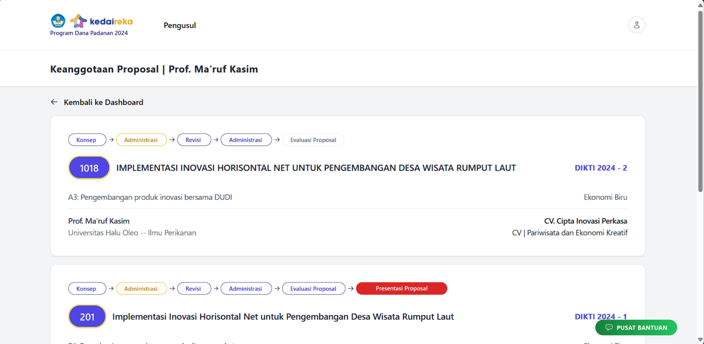<figcaption></figcaption></figure>

tkai\_profile\_innovator

#### **MODEL**

<table><thead><tr><th width="87">No</th><th width="288">Model</th><th>Nama Tabel</th></tr></thead><tbody><tr><td>1</td><td>MfProposal</td><td>mf_proposals</td></tr></tbody></table>

#### **RELASI**

<table><thead><tr><th width="187">Model / Tabel</th><th width="163">Relasi</th><th>Model/Tabel</th></tr></thead><tbody><tr><td>tkai_profile_innovator </td><td>belongs To </td><td>TkaiUser</td></tr><tr><td>mf_proposal </td><td>belongs to many </td><td>tkai_profile_innovator</td></tr><tr><td>mf_proposals</td><td>belong to </td><td>tkai_profile_industry</td></tr><tr><td>mf_proposals</td><td>has many</td><td>Mf_Proposal_anggotas (Anggota2024)</td></tr></tbody></table>

#### NAMA KOMPONEN

<table><thead><tr><th width="79">No</th><th width="288">Nama Folder</th><th>Nama File</th></tr></thead><tbody><tr><td>1</td><td>pengusul2024</td><td>keanggotaan-proposal</td></tr></tbody></table>

### Detail Innovator

***

#### **DOKUMENTASI**

<figure>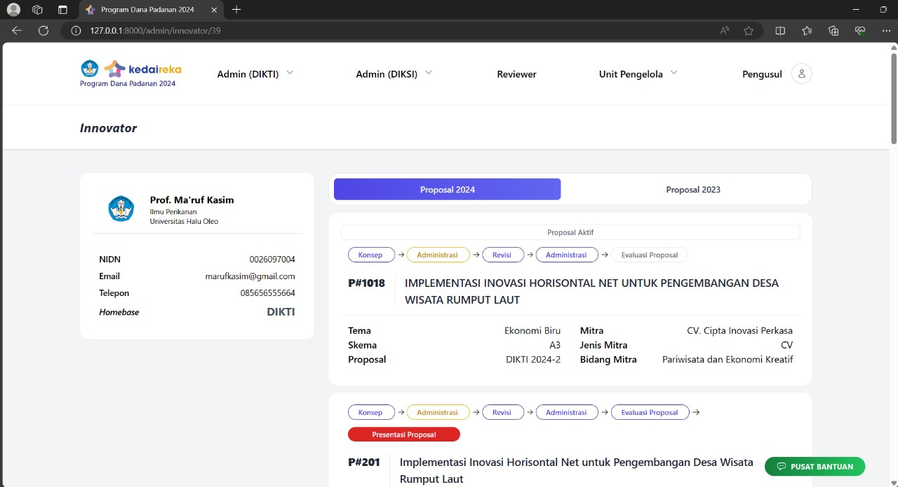<figcaption></figcaption></figure>

<figure>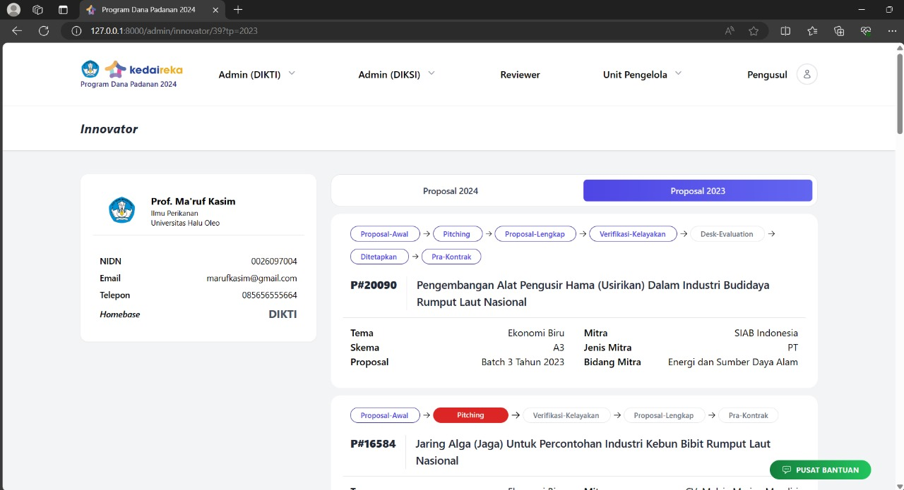<figcaption></figcaption></figure>

<figure>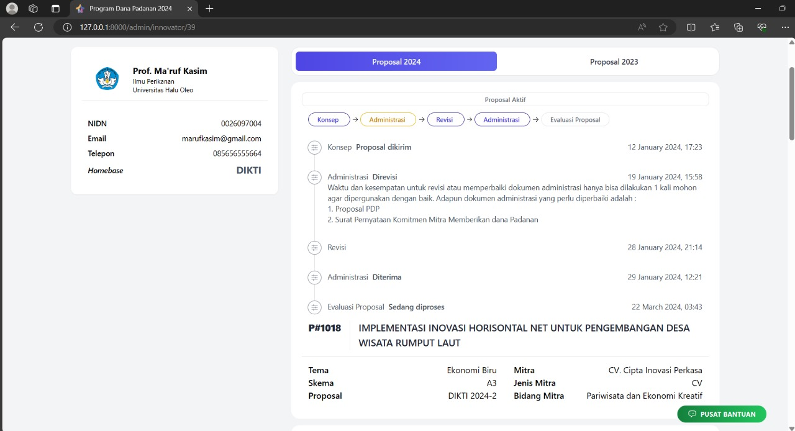<figcaption></figcaption></figure>

#### **MODEL**

2023

<table><thead><tr><th width="75">No</th><th width="288">Model</th><th>Nama Tabel</th></tr></thead><tbody><tr><td>1</td><td>TkaiInnovator</td><td>tkai_profile_innovator</td></tr><tr><td>2</td><td>MfProposal(24)</td><td>mf_proposals</td></tr><tr><td></td><td>MfProposalStatus(24)</td><td>mf_proposal_statuses</td></tr><tr><td>3</td><td>TkaiProposal</td><td>tkai_matching_fund</td></tr><tr><td></td><td>TxProposalStatus</td><td>tx_proposal_status</td></tr><tr><td>4</td><td>TkaiInnovation</td><td>tkai_innovation</td></tr><tr><td>5</td><td>TkaiBusinessCase </td><td>tkai_business_case</td></tr></tbody></table>

2024

<table><thead><tr><th width="79">No</th><th width="288">Model</th><th>Nama Tabel</th></tr></thead><tbody><tr><td>1</td><td>MfProposal</td><td></td></tr></tbody></table>

#### **RELASI**

TkaiInnovator belongs To TkaiUser

MfProposal belongs to MfSkema, MfTema, MfBatch, TkaiIndustry

TkaiProposal has one ProposalDitetapkan

TkaiProposal has many TkaiIndustry

TkaiBusinessCase has many TkaiBusinessBid

TkaiBusinessCase belongs to TkaiIndustry

TkaiInnovation has many TkaiInnovationBid

TkaiInnovation belongs to TkaiInnovator

MfProposalStatus belongs to MfProposal

TxProposalStatus belong to TkaiProposal

#### NAMA KOMPONEN

<table><thead><tr><th width="79">No</th><th width="288">Nama Folder</th><th>Nama File</th></tr></thead><tbody><tr><td>1</td><td>Innovator</td><td>Dashboard.php</td></tr><tr><td>2</td><td>Innovator</td><td>Sidebar.php</td></tr><tr><td>3</td><td>Komponen/Innovator</td><td>DaftarKolaborasi.php, DaftarProposal.php, Kolaborasi.php, Proposal2023.php</td></tr><tr><td>4</td><td>Komponen/Proposal2023</td><td>Status2023.php</td></tr></tbody></table>

## MITRA

***

### User Mitra

**DOKUMENTASI**

<figure><figcaption></figcaption></figure>

<figure>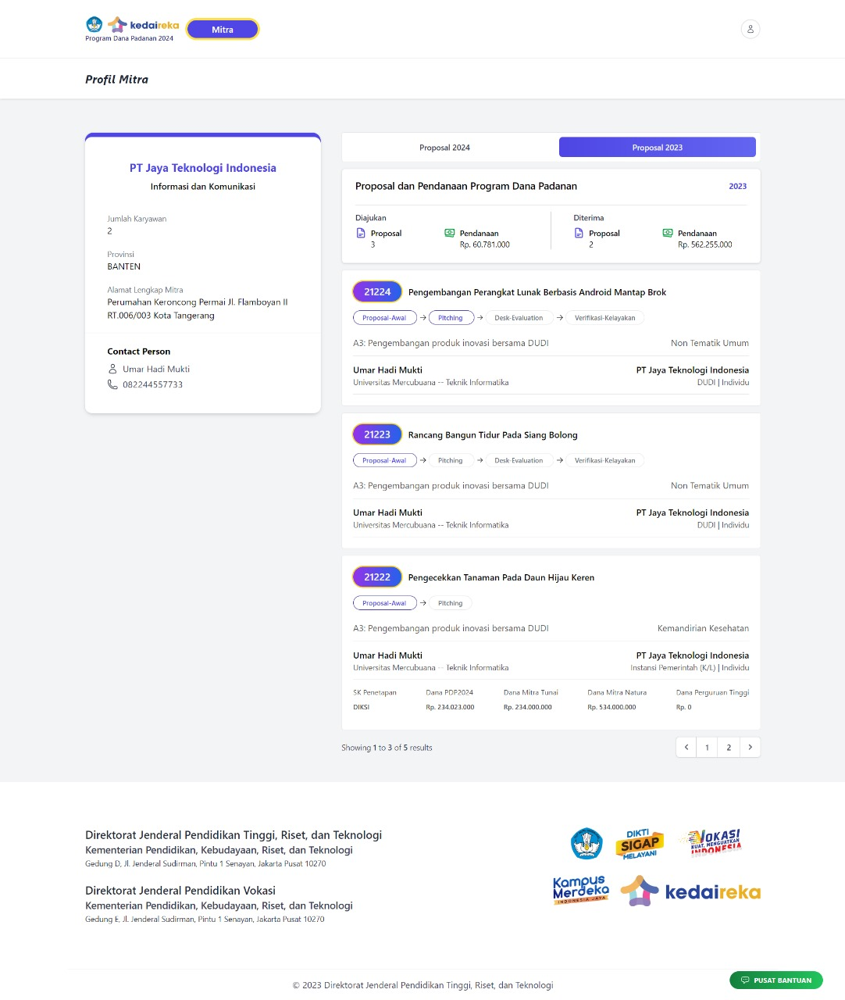<figcaption></figcaption></figure>

<figure>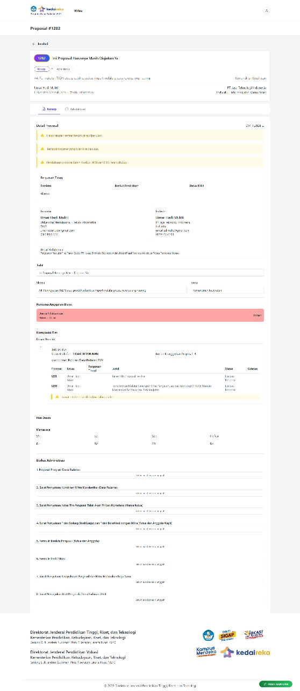<figcaption></figcaption></figure>

#### **MODEL**

<table><thead><tr><th width="79">No</th><th width="288">Model</th><th width="379">Nama Tabel</th></tr></thead><tbody><tr><td>1</td><td>TkaiUser</td><td>tkai_user</td></tr><tr><td>2</td><td>User</td><td>tkai_bo_user</td></tr><tr><td>3</td><td>TkaiIndustry</td><td>tkai_profile_industry</td></tr><tr><td>4</td><td>TkaiInnovator</td><td>tkai_profile_innovator</td></tr><tr><td>5</td><td>TkaiProposal</td><td>tkai_matching_fund</td></tr><tr><td>6</td><td>ProposalDitetapkan</td><td>proposal_ditetapkans</td></tr><tr><td>7</td><td>MfProposal</td><td>mf_proposals</td></tr><tr><td>8</td><td>TxProposalStatus</td><td>tx_proposal_status</td></tr><tr><td>9</td><td>MfProposalAnggaran</td><td>mf_proposal_anggarans</td></tr><tr><td>10</td><td>MfProposalPenetapan</td><td>mf_proposal_penetapans</td></tr><tr><td>11</td><td>AnggaranHonorarium</td><td>anggaran_honorarium</td></tr><tr><td>12</td><td>AnggaranPeralatanPendukung</td><td>anggaran_peralatan_pendukung</td></tr><tr><td>13</td><td>AnggaranBahanPrototype</td><td>anggaran_bahan_prototype</td></tr><tr><td>14</td><td>AnggaranPendampingan</td><td>anggaran_pendampingan</td></tr><tr><td>15</td><td>AnggaranFGD</td><td>anggaran_fgd</td></tr><tr><td>16</td><td>AnggaranSurvey</td><td>anggaran_survey</td></tr><tr><td>17</td><td>AnggaranPengujianProduk</td><td>anggaran_pengujian_produk</td></tr><tr><td>18</td><td>AnggaranPendaftaranHKI</td><td>anggaran_pendaftaran_hki</td></tr><tr><td>19</td><td>AnggaranBiayaPerjalananDinas</td><td>anggaran_biaya_perjalanan</td></tr><tr><td>20</td><td>AnggaranBantuanInsentifMahasiswa</td><td>anggaran_bantuan_insentif_mahasiswa</td></tr><tr><td>21</td><td>AnggaranProdukSkalaTerbatas</td><td>anggaran_produk_skala_terbatas</td></tr><tr><td>22</td><td>AnggaranPengelolaanProgram</td><td>anggaran_pengelolaan_program</td></tr></tbody></table>

#### **RELASI**

<table><thead><tr><th width="214">Model / Tabel</th><th width="149">Relasi</th><th>Model/Tabel</th></tr></thead><tbody><tr><td>tkai_profile_industry </td><td>belongs to</td><td>tkai_user</td></tr><tr><td>tkai_profile_industry </td><td>has many</td><td>tkai_matching_fund</td></tr><tr><td>tkai_profile_innovator</td><td>belongs to </td><td>tkai_user </td></tr><tr><td>tkai_profile_innovator</td><td>has many</td><td>tkai_user </td></tr><tr><td>mf_proposals </td><td>has one </td><td>mf_proposal_penetapans</td></tr><tr><td>mf_proposals</td><td>has many</td><td>mf_proposal_anggarans (Anggaran2024)</td></tr><tr><td>tkai_matching_fund </td><td>belongs to</td><td>tkai_profile_industry</td></tr><tr><td>tkai_matching_fund</td><td>has one</td><td>proposal_ditetapkans</td></tr><tr><td>tkai_matching_fund</td><td> has many </td><td><ul><li>anggaran_honorarium</li><li>anggaran_peralatan_pendukung</li><li>anggaran_bahan_prototype</li><li>anggaran_pendampingan</li><li>anggaran_fgd</li><li>anggaran_survey</li><li>anggaran_pengujian_produk</li><li>anggaran_pendaftaran_hki</li><li>anggaran_biaya_perjalanan</li><li>anggaran_bantuan_insentif_mahasiswa</li><li>anggaran_produk_skala_terbatas</li><li>anggaran_pengelolaan_program</li></ul></td></tr></tbody></table>

#### NAMA KOMPONEN

<table><thead><tr><th width="79">No</th><th width="288">Nama Folder</th><th>Nama File</th></tr></thead><tbody><tr><td>1</td><td>Mitra/User</td><td>ProfileMitra.php</td></tr><tr><td>2</td><td>Mitra/User</td><td>ProposalMitra.php</td></tr><tr><td>3</td><td>Mitra/User</td><td>ProposalMitra2023.php</td></tr><tr><td>4</td><td>Komponen/Mitra/User</td><td>ProfileCard.php</td></tr><tr><td>5</td><td>Komponen/Mitra/User</td><td>PendanaanProposal.php</td></tr><tr><td>6</td><td>Komponen/Mitra/User</td><td>ListProposal.php</td></tr><tr><td>7</td><td>Komponen/Mitra/User/Proposal</td><td>Proposal2023.php</td></tr><tr><td>8</td><td>Komponen/Mitra/User/Proposal</td><td>Proposal2024.php</td></tr></tbody></table>

### Daftar Mitra&#x20;

#### **DOKUMENTASI**

<figure><figcaption>
Tampilan Daftar Mitra
</figcaption></figure>

<figure><figcaption>
Proposal 2024
</figcaption></figure>

<figure><figcaption>
Proposal 2023
</figcaption></figure>

#### **MODEL**

2023

<table><thead><tr><th width="75">No</th><th width="288">Model</th><th>Nama Tabel</th></tr></thead><tbody><tr><td>1</td><td>tkaiIndustry</td><td>tkai_profile_industry</td></tr><tr><td>2</td><td>tkaiProposal</td><td>tkai_matching_fund</td></tr><tr><td>3</td><td></td><td>
anggaran_bahan_prototype

anggaran_bantuan_insentif_mahasiswa

anggaran_biaya_perjalanan

anggaran_fgd

anggaran_honorerium

anggaran_pendaftaran_hki

anggaran_pendampingan

anggaran_pengelolaan_program

anggaran_pengujian_produk

anggaran_peralatan_pendukung

anggaran_produk_skala_terbatas

anggaran_survey
</td></tr><tr><td>4</td><td>tx_proposal_status</td><td>tx_proposal_status</td></tr></tbody></table>

2024

<table><thead><tr><th width="79">No</th><th width="288">Model</th><th>Nama Tabel</th></tr></thead><tbody><tr><td>1</td><td>mf_proposal </td><td>mf_proposals</td></tr><tr><td>2</td><td>mf_proposal_anggaran</td><td>mf_proposal_anggarans</td></tr><tr><td>3</td><td></td><td>
mf_proposal_statuses

mf_proposal_penetapans
</td></tr></tbody></table>

#### RELASI

<table><thead><tr><th width="200">Model / Tabel</th><th width="149">Relasi</th><th>Model/Tabel</th></tr></thead><tbody><tr><td>Tkai_industry </td><td>has many </td><td>Tkai_matching_fund (Proposal 2023)</td></tr><tr><td>Tkai_industry </td><td>has many</td><td>Mf_Proposals (Proposal 2024)</td></tr><tr><td>Mf_Proposals </td><td>has many</td><td>Mf_Proposal_anggarans (Anggaran2024)</td></tr><tr><td>Tkai_matching_fund</td><td>has many </td><td><ul><li>anggaran_bahan_prototype</li><li>anggaran_bantuan_insentif_mahasiswa</li><li>anggaran_biaya_perjalanan, anggaran_fgd</li><li>anggaran_honorerium</li><li>anggaran_pendaftaran_hki</li><li>anggaran_pendampingan</li><li>anggaran_pengelolaan_program</li><li>anggaran_pengujian_produk</li><li>anggaran_pendukung</li><li>anggaran_produk_skala_terbatas</li><li>anggaran_survey,(Anggaran2023).                           </li></ul></td></tr><tr><td>Mf_Proposals </td><td> has one </td><td>
mf_proposal_penetapans 

(sk penetapan dan anggaran ditetapkan2024)
</td></tr><tr><td>tkai_matching_fund </td><td>has one</td><td>
proposal_ditetapkan 

(sk penetapan dan anggaran ditetapkan2023)
</td></tr></tbody></table>

#### NAMA KOMPONEN

<table><thead><tr><th width="79">No</th><th width="288">Nama Folder</th><th>Nama File</th></tr></thead><tbody><tr><td>1</td><td>komponen/mitra/</td><td>list_proposal2023, list_proposal2024</td></tr><tr><td>2</td><td><strong>index</strong> </td><td>show</td></tr><tr><td>3</td><td></td><td></td></tr></tbody></table>

## PERGURUAN TINGGI

***

### Unit Pengelola

(Bintang)

#### **DOKUMENTASI**

#### **MODEL**

<table><thead><tr><th width="75">No</th><th width="288">Model</th><th>Nama Tabel</th></tr></thead><tbody><tr><td>1</td><td>TkaiInnovator</td><td>tkai_profile_innovator</td></tr><tr><td>2</td><td>MfProposal(24)</td><td>mf_proposals</td></tr><tr><td>3</td><td>MfProposalStatus(24)</td><td>mf_proposal_statuses</td></tr><tr><td>4</td><td>TkaiProposal</td><td>tkai_matching_fund</td></tr><tr><td>5</td><td>TxProposalStatus</td><td>tx_proposal_status</td></tr><tr><td>6</td><td>TkaiInnovation</td><td>tkai_innovation</td></tr><tr><td>7</td><td>TkaiMitra</td><td>tkai_profile_industry</td></tr><tr><td>8</td><td>TkaiProposalDes</td><td>tkai_matching_fund_desc</td></tr><tr><td>9</td><td>ProposalDitetapkan</td><td>tkai_matching_fund</td></tr></tbody></table>

#### **RELASI**

<table><thead><tr><th width="187">Model / Tabel</th><th width="149">Relasi</th><th>Model/Tabel</th></tr></thead><tbody><tr><td>TkaiInnovator</td><td>belongs To </td><td>TkaiUser</td></tr><tr><td>MfProposal </td><td>belongs to </td><td><ul><li>MfSkema</li><li>MfTema</li><li>MfBatch</li><li>TkaiIndustry</li><li>TkaiProfileInnovator</li><li>TkaiProfileIndustry</li></ul></td></tr><tr><td>TkaiProposal </td><td>has one </td><td>ProposalDitetapkan</td></tr><tr><td>TkaiProposal</td><td>has many</td><td>TkaiIndustry</td></tr><tr><td>TkaiBusinessCase</td><td>has many </td><td>TkaiBusinessBid</td></tr><tr><td>TkaiBusinessCase</td><td>belongs to </td><td>TkaiIndustry</td></tr><tr><td>TkaiInnovation </td><td>has many </td><td>TkaiInnovationBid</td></tr><tr><td>TkaiInnovation </td><td> belongs to </td><td>TkaiInnovator</td></tr><tr><td>MfProposalStatus </td><td>belong to</td><td>MfProposal (2024)</td></tr><tr><td>TxProposalStatus </td><td>belong to</td><td>TkaiProposal (2023)</td></tr></tbody></table>

#### NAMA KOMPONEN

<table><thead><tr><th width="79">No</th><th width="348">Nama Folder</th><th>Nama File</th></tr></thead><tbody><tr><td>1</td><td>Komponen/UnitPengelola/TahunSebelum</td><td>
DaftarProposal2021.php, DaftarProposal2022.php, DaftarProposal2023.php, 

DaftarProposal.php
</td></tr><tr><td></td><td>Livewire/Proposal/TahunSebelumnya</td><td>Status.php, Status2023.php</td></tr><tr><td>2</td><td>Livewire/UnitPengelola/DaftarUsulan/</td><td>Index.php</td></tr></tbody></table>

### Detail Proposal

(Jalu)

#### **MODEL**

<table><thead><tr><th width="75">No</th><th width="288">Model</th><th>Nama Tabel</th></tr></thead><tbody><tr><td>1</td><td>RiwayatPengusul</td><td>riwayat_pengusul</td></tr><tr><td>2</td><td>MfProposal(24)</td><td>mf_proposals</td></tr><tr><td>3</td><td>MfProposalStatus(24)</td><td>mf_proposal_statuses</td></tr><tr><td>4</td><td>TkaiProposal</td><td>tkai_matching_fund</td></tr><tr><td>5</td><td>TkaiProposalDesc</td><td>tkai_matching_fund_description</td></tr><tr><td>6</td><td>MasterDocument</td><td>master_documents</td></tr><tr><td>7</td><td>TxProposalStatus</td><td>tx_proposal_status</td></tr></tbody></table>

#### **RELASI**

**(kosong)**

<table><thead><tr><th width="187">Model / Tabel</th><th width="149">Relasi</th><th>Model/Tabel</th></tr></thead><tbody><tr><td>TkaiInnovator</td><td>belongs To </td><td>TkaiUser</td></tr><tr><td>MfProposal </td><td>belongs to </td><td><ul><li>MfSkema</li><li>MfTema</li><li>MfBatch</li><li>TkaiIndustry</li><li>TkaiProfileInnovator</li><li>TkaiProfileIndustry</li></ul></td></tr><tr><td>TkaiProposal </td><td>has one </td><td>ProposalDitetapkan</td></tr><tr><td>TkaiProposal</td><td>has many</td><td>TkaiIndustry</td></tr><tr><td>TkaiBusinessCase</td><td>has many </td><td>TkaiBusinessBid</td></tr><tr><td>TkaiBusinessCase</td><td>belongs to </td><td>TkaiIndustry</td></tr><tr><td>TkaiInnovation </td><td>has many </td><td>TkaiInnovationBid</td></tr><tr><td>TkaiInnovation </td><td> belongs to </td><td>TkaiInnovator</td></tr><tr><td>MfProposalStatus </td><td>belong to</td><td>MfProposal (2024)</td></tr><tr><td>TxProposalStatus </td><td>belong to</td><td>TkaiProposal (2023)</td></tr></tbody></table>

#### NAMA KOMPONEN

<table><thead><tr><th width="79">No</th><th width="348">Nama Folder</th><th>Nama File</th></tr></thead><tbody><tr><td>1</td><td>Komponen/Proposal/Status</td><td>Status.php</td></tr><tr><td></td><td>Komponen/Proposal-similar</td><td>proposalsimiliar.php</td></tr><tr><td>2</td><td>Komponen/Proposal-mitra</td><td>Proposalmitra.php</td></tr><tr><td></td><td>Komponen/Proposal/Detail</td><td>Detail.php</td></tr><tr><td></td><td>Komponen/Proposal/Pra-kontrak ( 1-5 24)</td><td>Prakontrak.php</td></tr><tr><td></td><td>Komponen/Proposal/Tahun-sebelumnya/Status2023</td><td>Status2023.php</td></tr><tr><td></td><td>Livewire/Informasi-pengusul-dan-mitra</td><td>Informasipengusuldanmitra.php</td></tr><tr><td></td><td>Livewire/Informasi-proposal</td><td>Informasiproposal.php</td></tr><tr><td></td><td>Livewire/Anggota-peneliti</td><td>Anggotapeneliti.php</td></tr><tr><td></td><td>Livewire/Verifikasi-dokumen</td><td>Verifikasidokumen.php</td></tr><tr><td></td><td>Livewire/Verifikasi-proposal</td><td>Verifikasiproposal.php</td></tr><tr><td></td><td>Livewire/Anggaran-pengusul-rekap</td><td>Anggaranpengusulrekap.php</td></tr><tr><td></td><td>Livewire/Vk-ulang-consent</td><td>Vkulangconsent.php</td></tr><tr><td></td><td>Livewire/Proposal-luaran</td><td>Proposalluaran.php</td></tr><tr><td></td><td>Livewire/Realisasi-luaran</td><td>realisasiluaran.php</td></tr><tr><td></td><td>Livewire/Log-aktivitas</td><td>Logaktivitas.php</td></tr><tr><td></td><td>Pelaporan/Anggaran-keseluruhan</td><td>Anggarankeseluruhan.php</td></tr><tr><td></td><td>Komponen/Pengusul/Laporan-akhir</td><td>Laporanakhir.php</td></tr><tr><td></td><td>Komponen/Berkas</td><td>Berkas.php</td></tr><tr><td></td><td>Reviewer/Penugasan-rekon</td><td>Rekon.php</td></tr></tbody></table>
