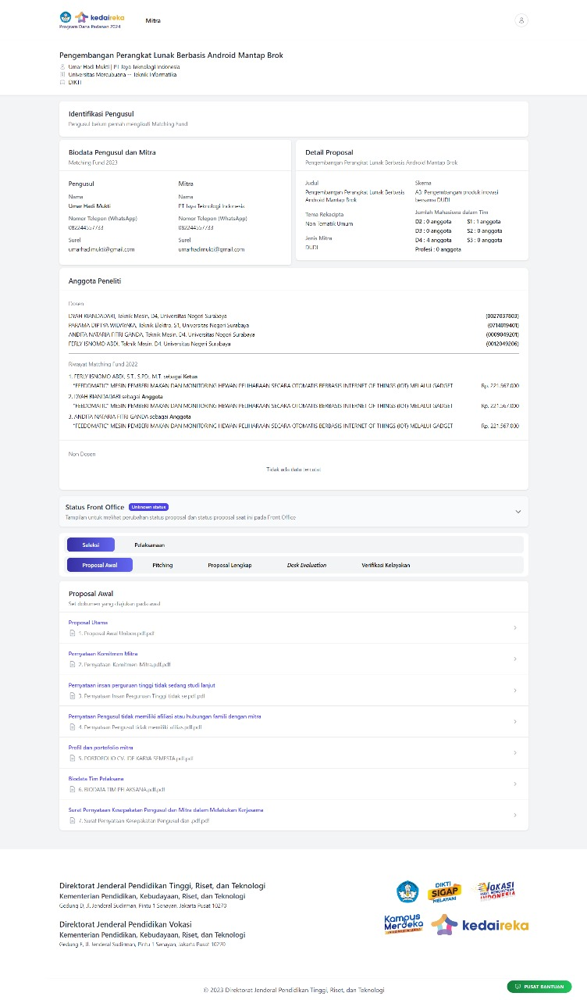

# Dokumentasi Teknis

## INNOVATOR

***

### List Innovator

#### **Dokumentasi**

<figure><figcaption>
Tampilan List Innovator
</figcaption></figure>

<figure><figcaption>
Tampilan Detail Innovator
</figcaption></figure>

<figure><figcaption>
Filter Perguruan Tinggi
</figcaption></figure>

<figure><figcaption>
Filter Direktorat
</figcaption></figure>

<figure><figcaption>
Filter Innovator
</figcaption></figure>

<figure><figcaption>
Multiple Filter
</figcaption></figure>

#### Keterangan

<table><thead><tr><th width="181">Fitur</th><th width="211">Deskripsi </th><th width="165">Latar Belakang</th><th>Tujuan</th></tr></thead><tbody><tr><td>List Innovator</td><td>Fitur ini berisi Daftar Innovator yang mengajukan proposal.</td><td>karena fitur tersebut belum ada sebelumnya.</td><td>Berfungsi untuk menampilkan Innovator  yang mengajukan proposal.</td></tr><tr><td>Filter (Perguruan Tinggi, Direktorat, dan Innovator)</td><td>Fitur ini berisi Filter pencarian berdasarkan Perguruan Tinggi, Direktorat, dan Innovator yang dituju</td><td>karena fitur tersebut belum ada sebelumnya.</td><td>Berfungsi untuk mempermudah pencarian berdasarkan Perguruan Tinggi, Direktorat, dan Innovator</td></tr></tbody></table>

#### **Model**

<table><thead><tr><th width="75">No</th><th width="288">Model</th><th width="401">Nama Tabel</th></tr></thead><tbody><tr><td>1</td><td>TkaiInnovator</td><td>tkai_profile_innovator(tkai)</td></tr><tr><td>2</td><td>MfProposal (24)</td><td>mf_proposals</td></tr><tr><td>3</td><td>MfProposalPenetapan (24)</td><td>mf_proposal_penetapans</td></tr><tr><td>4</td><td>TkaiProposal(23)</td><td>tkai_matching_fund</td></tr><tr><td>5</td><td>ProposalDitetapkan</td><td>proposal_ditetapkans</td></tr><tr><td>6</td><td>TkaiPerguruanTinggi</td><td>tkai_master_pt</td></tr></tbody></table>

#### **Relasi**

<table><thead><tr><th width="212">Model / Tabel</th><th width="163">Relasi</th><th>Model/Tabel</th></tr></thead><tbody><tr><td>tkai_profile_innovator </td><td>belongs to </td><td>tkai_user</td></tr><tr><td>tkai_profile_innovator  </td><td>has many </td><td>mf_proposals </td></tr><tr><td>mf_proposals</td><td> has one  </td><td>mf_proposal_penetapans</td></tr><tr><td>mf_proposals</td><td>has many</td><td>Mf_Proposal_anggotas (Anggota2024)</td></tr><tr><td>Tkai_matching_fund </td><td></td><td><ul><li>anggaran_bahan_prototype</li><li>anggaran_bantuan_insentif_mahasiswa</li><li>anggaran_biaya_perjalanan</li><li>anggaran_fgd, anggaran_honorerium</li><li>anggaran_pendaftaran_hki</li><li>anggaran_pendampingan</li><li>anggaran_pengelolaan_program</li><li>anggaran_pengujian_produk</li><li>anggaran_pendukung</li><li>anggaran_produk_skala_terbatas</li><li>anggaran_survey,(Anggaran2023)</li></ul>

</td></tr><tr><td>Tkai_matching_fund</td><td>has one</td><td>proposal_ditetapkans</td></tr></tbody></table>

#### Nama Komponen

<table><thead><tr><th width="79">No</th><th width="288">Nama Folder</th><th>Nama File</th></tr></thead><tbody><tr><td>1</td><td>innovator</td><td>index</td></tr></tbody></table>

**Keanggotaan Proposal**

#### **DOKUMENTASI**

<figure><figcaption></figcaption></figure>

#### Model

<table><thead><tr><th width="87">No</th><th width="288">Model</th><th>Nama Tabel</th></tr></thead><tbody><tr><td>1</td><td>MfProposal</td><td>mf_proposals</td></tr></tbody></table>

#### **Relasi**

<table><thead><tr><th width="187">Model / Tabel</th><th width="163">Relasi</th><th>Model/Tabel</th></tr></thead><tbody><tr><td>tkai_profile_innovator </td><td>belongs To </td><td>TkaiUser</td></tr><tr><td>mf_proposal </td><td>belongs to many </td><td>tkai_profile_innovator</td></tr><tr><td>mf_proposals</td><td>belong to </td><td>tkai_profile_industry</td></tr><tr><td>mf_proposals</td><td>has many</td><td>Mf_Proposal_anggotas (Anggota2024)</td></tr></tbody></table>

#### Nama Komponen

<table><thead><tr><th width="79">No</th><th width="288">Nama Folder</th><th>Nama File</th></tr></thead><tbody><tr><td>1</td><td>pengusul2024</td><td>keanggotaan-proposal</td></tr></tbody></table>

### Detail Innovator

#### **Dokumentasi**

<figure><figcaption>
Proposal 2024
</figcaption></figure>

<figure><figcaption>
Proposal 2023
</figcaption></figure>

<figure><figcaption>
Detail 
</figcaption></figure>

#### Keterangan

<table><thead><tr><th width="152">Fitur</th><th width="217">Deskripsi </th><th width="187">Latar Belakang</th><th>Tujuan</th></tr></thead><tbody><tr><td>
List Innovator

2023, 2024
</td><td>Fitur ini berisi Daftar Proposal yang akan diajukan dan diterima</td><td>karena fitur tersebut belum ada sebelumnya.</td><td>Berfungsi untuk menampilkan Innovator yang mengajukan proposal.</td></tr><tr><td>Detail Innovator 2023, 2024</td><td>Fitur ini berisi Daftar Proposal yang akan diajukan dan diterima</td><td>karena fitur tersebut belum ada sebelumnya.</td><td>Berfungsi untuk menampilkan Detail Innovator yang mengajukan proposal</td></tr><tr><td>Data profile Innovator</td><td>Fitur ini berisi untuk menampilkan data </td><td>karena fitur tersebut belum ada sebelumnya.</td><td>Berfungsi untuk menampilkan Data Profile Innovator</td></tr><tr><td>Daftar Kolaborasi</td><td>Fitur ini berfungsi untuk mengetahui peran Innovator </td><td>karena fitur tersebut belum ada sebelumnya.</td><td>Berfungsi untuk mengetahui peran yang diemban oleh Innovator serta di mana ia berkontribusi dalam proposal tersebut.</td></tr></tbody></table>

#### **Model**

2023

<table><thead><tr><th width="75">No</th><th width="288">Model</th><th>Nama Tabel</th></tr></thead><tbody><tr><td>1</td><td>TkaiInnovator</td><td>tkai_profile_innovator</td></tr><tr><td>2</td><td>MfProposal(24)</td><td>mf_proposals</td></tr><tr><td></td><td>MfProposalStatus(24)</td><td>mf_proposal_statuses</td></tr><tr><td>3</td><td>TkaiProposal</td><td>tkai_matching_fund</td></tr><tr><td></td><td>TxProposalStatus</td><td>tx_proposal_status</td></tr><tr><td>4</td><td>TkaiInnovation</td><td>tkai_innovation</td></tr><tr><td>5</td><td>TkaiBusinessCase </td><td>tkai_business_case</td></tr></tbody></table>

2024

<table><thead><tr><th width="79">No</th><th width="288">Model</th><th>Nama Tabel</th></tr></thead><tbody><tr><td>1</td><td>MfProposal</td><td></td></tr></tbody></table>

#### **Relasi**

<table><thead><tr><th width="187">Model / Tabel</th><th width="163">Relasi</th><th>Model/Tabel</th></tr></thead><tbody><tr><td>TkaiInnovator</td><td>belongs to</td><td>TkaiUser</td></tr><tr><td>MfProposal</td><td>belongs to</td><td><ul><li>MfSkema </li><li>MfTema </li><li>MfBatch</li><li>TkaiIndustry</li></ul></td></tr><tr><td>TkaiProposal</td><td>has one </td><td>ProposalDitetapkan</td></tr><tr><td>TkaiProposal</td><td> has many </td><td>TkaiIndustry</td></tr><tr><td>TkaiBusinessCase</td><td>has many </td><td>TkaiBusinessBid</td></tr><tr><td>TkaiBusinessCase </td><td>belongs to</td><td>TkaiIndustry</td></tr><tr><td>TkaiInnovation</td><td>has many </td><td>TkaiInnovationBid</td></tr><tr><td>TkaiInnovation</td><td>belongs to</td><td>TkaiInnovator</td></tr><tr><td>MfProposalStatus</td><td>belongs to</td><td>MfProposal</td></tr><tr><td>TxProposalStatus</td><td>belongs to</td><td>TkaiProposal</td></tr></tbody></table>

#### NAMA KOMPONEN

<table><thead><tr><th width="79">No</th><th width="288">Nama Folder</th><th>Nama File</th></tr></thead><tbody><tr><td>1</td><td>Innovator</td><td>Dashboard.php</td></tr><tr><td>2</td><td>Innovator</td><td>Sidebar.php</td></tr><tr><td>3</td><td>Komponen/Innovator</td><td>DaftarKolaborasi.php, DaftarProposal.php, Kolaborasi.php, Proposal2023.php</td></tr><tr><td>4</td><td>Komponen/Proposal2023</td><td>Status2023.php</td></tr></tbody></table>

## MITRA

***

### &#x20;User Mitra

#### **Dokumentasi**

<figure><figcaption></figcaption></figure>

<figure><figcaption></figcaption></figure>

<figure><figcaption></figcaption></figure>

#### **Keterangan**

<table><thead><tr><th width="141">Fitur</th><th width="217">Deskripsi </th><th width="195">Latar Belakang</th><th>Tujuan</th></tr></thead><tbody><tr><td>Profile Mitra</td><td>Profil Mitra meliputi Nama, Bidang Usaha, Jumlah Karyawan, Provinsi, Alamat Lengkap, dan Kontak.</td><td>karena fitur tersebut belum ada sebelumnya.</td><td>Berfungsi untuk menampilkan profil mitra</td></tr><tr><td>Pendanaan Proposal</td><td>Fitur ini memungkinkan untuk memantau total proposal yang diajukan dan diterima, serta total pendanaan yang diajukan dan diterima.</td><td>karena fitur tersebut belum ada sebelumnya.</td><td>Berfungsi untuk total proposal yang diajukan dan diterima, pendanaan yang diajukan dan diterima</td></tr><tr><td>List Proposal 2023/2024</td><td>Fitur ini memungkinkan pengguna untuk melihat daftar lengkap proposal yang diajukan dan diterima dalam periode 2023/2024</td><td>karena fitur tersebut belum ada sebelumnya.</td><td>Berfungsi untuk mengetahui Daftar Proposal yang diajukan dan diterima </td></tr><tr><td>Detail Proposal 2023/2024</td><td>Fitur ini memberikan akses untuk melihat detail lengkap dari setiap proposal yang dipilih untuk periode 2023/2024.</td><td>karena fitur tersebut belum ada sebelumnya.</td><td>berfungsi untuk menampilkan informasi lengkap mengenai proposal yang dipilih oleh pengguna.</td></tr></tbody></table>

#### **Model**

<table><thead><tr><th width="79">No</th><th width="288">Model</th><th width="379">Nama Tabel</th></tr></thead><tbody><tr><td>1</td><td>TkaiUser</td><td>tkai_user</td></tr><tr><td>2</td><td>User</td><td>tkai_bo_user</td></tr><tr><td>3</td><td>TkaiIndustry</td><td>tkai_profile_industry</td></tr><tr><td>4</td><td>TkaiInnovator</td><td>tkai_profile_innovator</td></tr><tr><td>5</td><td>TkaiProposal</td><td>tkai_matching_fund</td></tr><tr><td>6</td><td>ProposalDitetapkan</td><td>proposal_ditetapkans</td></tr><tr><td>7</td><td>MfProposal</td><td>mf_proposals</td></tr><tr><td>8</td><td>TxProposalStatus</td><td>tx_proposal_status</td></tr><tr><td>9</td><td>MfProposalAnggaran</td><td>mf_proposal_anggarans</td></tr><tr><td>10</td><td>MfProposalPenetapan</td><td>mf_proposal_penetapans</td></tr><tr><td>11</td><td>AnggaranHonorarium</td><td>anggaran_honorarium</td></tr><tr><td>12</td><td>AnggaranPeralatanPendukung</td><td>anggaran_peralatan_pendukung</td></tr><tr><td>13</td><td>AnggaranBahanPrototype</td><td>anggaran_bahan_prototype</td></tr><tr><td>14</td><td>AnggaranPendampingan</td><td>anggaran_pendampingan</td></tr><tr><td>15</td><td>AnggaranFGD</td><td>anggaran_fgd</td></tr><tr><td>16</td><td>AnggaranSurvey</td><td>anggaran_survey</td></tr><tr><td>17</td><td>AnggaranPengujianProduk</td><td>anggaran_pengujian_produk</td></tr><tr><td>18</td><td>AnggaranPendaftaranHKI</td><td>anggaran_pendaftaran_hki</td></tr><tr><td>19</td><td>AnggaranBiayaPerjalananDinas</td><td>anggaran_biaya_perjalanan</td></tr><tr><td>20</td><td>AnggaranBantuanInsentifMahasiswa</td><td>anggaran_bantuan_insentif_mahasiswa</td></tr><tr><td>21</td><td>AnggaranProdukSkalaTerbatas</td><td>anggaran_produk_skala_terbatas</td></tr><tr><td>22</td><td>AnggaranPengelolaanProgram</td><td>anggaran_pengelolaan_program</td></tr></tbody></table>

#### **Relasi**

<table><thead><tr><th width="214">Model / Tabel</th><th width="149">Relasi</th><th>Model/Tabel</th></tr></thead><tbody><tr><td>tkai_profile_industry </td><td>belongs to</td><td>tkai_user</td></tr><tr><td>tkai_profile_industry </td><td>has many</td><td>tkai_matching_fund</td></tr><tr><td>tkai_profile_innovator</td><td>belongs to </td><td>tkai_user </td></tr><tr><td>tkai_profile_innovator</td><td>has many</td><td>tkai_user </td></tr><tr><td>mf_proposals </td><td>has one </td><td>mf_proposal_penetapans</td></tr><tr><td>mf_proposals</td><td>has many</td><td>mf_proposal_anggarans (Anggaran2024)</td></tr><tr><td>tkai_matching_fund </td><td>belongs to</td><td>tkai_profile_industry</td></tr><tr><td>tkai_matching_fund</td><td>has one</td><td>proposal_ditetapkans</td></tr><tr><td>tkai_matching_fund</td><td> has many </td><td><ul><li>anggaran_honorarium</li><li>anggaran_peralatan_pendukung</li><li>anggaran_bahan_prototype</li><li>anggaran_pendampingan</li><li>anggaran_fgd</li><li>anggaran_survey</li><li>anggaran_pengujian_produk</li><li>anggaran_pendaftaran_hki</li><li>anggaran_biaya_perjalanan</li><li>anggaran_bantuan_insentif_mahasiswa</li><li>anggaran_produk_skala_terbatas</li><li>anggaran_pengelolaan_program</li></ul></td></tr></tbody></table>

#### Nama Komponen

<table><thead><tr><th width="79">No</th><th width="288">Nama Folder</th><th>Nama File</th></tr></thead><tbody><tr><td>1</td><td>Mitra/User</td><td>ProfileMitra.php</td></tr><tr><td>2</td><td>Mitra/User</td><td>ProposalMitra.php</td></tr><tr><td>3</td><td>Mitra/User</td><td>ProposalMitra2023.php</td></tr><tr><td>4</td><td>Komponen/Mitra/User</td><td>ProfileCard.php</td></tr><tr><td>5</td><td>Komponen/Mitra/User</td><td>PendanaanProposal.php</td></tr><tr><td>6</td><td>Komponen/Mitra/User</td><td>ListProposal.php</td></tr><tr><td>7</td><td>Komponen/Mitra/User/Proposal</td><td>Proposal2023.php</td></tr><tr><td>8</td><td>Komponen/Mitra/User/Proposal</td><td>Proposal2024.php</td></tr></tbody></table>

### Daftar Mitra&#x20;

#### **Dokumentasi**

<figure><figcaption>
Tampilan Daftar Mitra
</figcaption></figure>

<figure><figcaption>
Proposal 2024
</figcaption></figure>

<figure><figcaption>
Proposal 2023
</figcaption></figure>

<table><thead><tr><th width="161">Fitur</th><th width="217">Deskripsi </th><th width="182">Latar Belakang</th><th>Tujuan</th></tr></thead><tbody><tr><td>Proposal 2023/2024</td><td>Fitur ini berisi Daftar Proposal yang telah diajukan</td><td>karena fitur tersebut belum ada sebelumnya. </td><td>Berfungsi untuk menampilkan proposal  yang telah diajukan</td></tr><tr><td>
Filter 

(Nama Mitra, 

Jenis Mitra, Kategori Mitra, Provinsi Mitra)
</td><td>Fitur ini berisi Filter pencarian berdasarkan Nama Mitra, Jenis Mitra, Kategori Mitra, Provinsi Mitra</td><td>Karena dibutuhkan  untuk mencari informasi berdasarkan kriteria tertentu</td><td>Berfungsi untuk mempermudah pencarian berdasarkan Nama Mitra, Jenis Mitra, Kategori Mitra, Provinsi Mitra</td></tr><tr><td>Multiple filter</td><td>Fitur ini berisi Filter pencarian multiple untuk pencarian ganda</td><td>Karena dibutuhkan untuk mencari informasi berdasarkan berbagai ketentuan tertentu</td><td>Berfungsi untuk memungkinkan pengguna memasukkan beberapa parameter pencarian dalam filter.</td></tr><tr><td>Daftar Mitra</td><td>Fitur ini berisi Daftar Mitra yang terdaftar</td><td>Karena fitur tersebut belum ada sebelumnya.</td><td>Berfungsi untuk memberikan informasi tentang daftar mitra yang terdaftar.</td></tr><tr><td>Export Mitra</td><td>Fitur ini berisi Export data Mitra dan anggaran-anggaran</td><td>Karena fitur tersebut belum ada sebelumnya.</td><td>Berfungsi untuk mengekspor data mitra dan anggaran-anggaran.</td></tr></tbody></table>

#### **Model**

2023

<table><thead><tr><th width="75">No</th><th width="288">Model</th><th>Nama Tabel</th></tr></thead><tbody><tr><td>1</td><td>tkaiIndustry</td><td>tkai_profile_industry</td></tr><tr><td>2</td><td>tkaiProposal</td><td>tkai_matching_fund</td></tr><tr><td>3</td><td></td><td>
anggaran_bahan_prototype

anggaran_bantuan_insentif_mahasiswa

anggaran_biaya_perjalanan

anggaran_fgd

anggaran_honorerium

anggaran_pendaftaran_hki

anggaran_pendampingan

anggaran_pengelolaan_program

anggaran_pengujian_produk

anggaran_peralatan_pendukung

anggaran_produk_skala_terbatas

anggaran_survey
</td></tr><tr><td>4</td><td>tx_proposal_status</td><td>tx_proposal_status</td></tr></tbody></table>

2024

<table><thead><tr><th width="79">No</th><th width="288">Model</th><th>Nama Tabel</th></tr></thead><tbody><tr><td>1</td><td>mf_proposal </td><td>mf_proposals</td></tr><tr><td>2</td><td>mf_proposal_anggaran</td><td>mf_proposal_anggarans</td></tr><tr><td>3</td><td></td><td>
mf_proposal_statuses

mf_proposal_penetapans
</td></tr></tbody></table>

#### Relasi

<table><thead><tr><th width="200">Model / Tabel</th><th width="149">Relasi</th><th>Model/Tabel</th></tr></thead><tbody><tr><td>Tkai_industry </td><td>has many </td><td>Tkai_matching_fund (Proposal 2023)</td></tr><tr><td>Tkai_industry </td><td>has many</td><td>Mf_Proposals (Proposal 2024)</td></tr><tr><td>Mf_Proposals </td><td>has many</td><td>Mf_Proposal_anggarans (Anggaran2024)</td></tr><tr><td>Tkai_matching_fund</td><td>has many </td><td><ul><li>anggaran_bahan_prototype</li><li>anggaran_bantuan_insentif_mahasiswa</li><li>anggaran_biaya_perjalanan, anggaran_fgd</li><li>anggaran_honorerium</li><li>anggaran_pendaftaran_hki</li><li>anggaran_pendampingan</li><li>anggaran_pengelolaan_program</li><li>anggaran_pengujian_produk</li><li>anggaran_pendukung</li><li>anggaran_produk_skala_terbatas</li><li>anggaran_survey,(Anggaran2023).                           </li></ul></td></tr><tr><td>Mf_Proposals </td><td> has one </td><td>
mf_proposal_penetapans 

(sk penetapan dan anggaran ditetapkan2024)
</td></tr><tr><td>tkai_matching_fund </td><td>has one</td><td>
proposal_ditetapkan 

(sk penetapan dan anggaran ditetapkan2023)
</td></tr></tbody></table>

#### Nama Komponen

<table><thead><tr><th width="79">No</th><th width="288">Nama Folder</th><th>Nama File</th></tr></thead><tbody><tr><td>1</td><td>komponen/mitra/</td><td>list_proposal2023, list_proposal2024</td></tr><tr><td>2</td><td><strong>index</strong> </td><td>show</td></tr><tr><td>3</td><td></td><td></td></tr></tbody></table>

## PERGURUAN TINGGI

***

### List Proposal

(Bintang)

#### **Dokumentasi**

<figure><figcaption>
Proposal 2023 (Ditetapkan)
</figcaption></figure>

<figure><figcaption>
Proposal 2023 (Semua)
</figcaption></figure>

<figure><figcaption>
Proposal 2022
</figcaption></figure>

<figure><figcaption>
Filter Search
</figcaption></figure>

<figure><figcaption></figcaption></figure>

#### Keterangan

<table><thead><tr><th width="188">Fitur</th><th width="217">Deskripsi </th><th width="195">Latar Belakang</th><th>Tujuan</th></tr></thead><tbody><tr><td>List Proposal 20232024</td><td>Fitur ini berisi Daftar proposal yang telah diajukan </td><td>karena fitur tersebut belum ada sebelumnya.</td><td>Berfungsi untuk menampilkan proposal berdasarkan tahun</td></tr><tr><td>
Filter 

(company name, nama innovator, proposal id, judul proposal)
</td><td>Fitur ini berisi Filter pencarian berdasarkan Company Name, Nama Innovator, Proposal Id, dan Judul Proposal yang dituju</td><td>karena fitur tersebut belum ada sebelumnya.</td><td>Berfungsi untuk mempermudah pencarian berdasarkan </td></tr></tbody></table>

#### **Model**

<table><thead><tr><th width="75">No</th><th width="288">Model</th><th>Nama Tabel</th></tr></thead><tbody><tr><td>1</td><td>TkaiInnovator</td><td>tkai_profile_innovator</td></tr><tr><td>2</td><td>MfProposal(24)</td><td>mf_proposals</td></tr><tr><td>3</td><td>MfProposalStatus(24)</td><td>mf_proposal_statuses</td></tr><tr><td>4</td><td>TkaiProposal</td><td>tkai_matching_fund</td></tr><tr><td>5</td><td>TxProposalStatus</td><td>tx_proposal_status</td></tr><tr><td>6</td><td>TkaiInnovation</td><td>tkai_innovation</td></tr><tr><td>7</td><td>TkaiMitra</td><td>tkai_profile_industry</td></tr><tr><td>8</td><td>TkaiProposalDes</td><td>tkai_matching_fund_desc</td></tr><tr><td>9</td><td>ProposalDitetapkan</td><td>tkai_matching_fund</td></tr></tbody></table>

#### **Relasi**

<table><thead><tr><th width="187">Model / Tabel</th><th width="149">Relasi</th><th>Model/Tabel</th></tr></thead><tbody><tr><td>TkaiInnovator</td><td>belongs To </td><td>TkaiUser</td></tr><tr><td>MfProposal </td><td>belongs to </td><td><ul><li>MfSkema</li><li>MfTema</li><li>MfBatch</li><li>TkaiIndustry</li><li>TkaiProfileInnovator</li><li>TkaiProfileIndustry</li></ul></td></tr><tr><td>TkaiProposal </td><td>has one </td><td>ProposalDitetapkan</td></tr><tr><td>TkaiProposal</td><td>has many</td><td>TkaiIndustry</td></tr><tr><td>TkaiBusinessCase</td><td>has many </td><td>TkaiBusinessBid</td></tr><tr><td>TkaiBusinessCase</td><td>belongs to </td><td>TkaiIndustry</td></tr><tr><td>TkaiInnovation </td><td>has many </td><td>TkaiInnovationBid</td></tr><tr><td>TkaiInnovation </td><td> belongs to </td><td>TkaiInnovator</td></tr><tr><td>MfProposalStatus </td><td>belong to</td><td>MfProposal (2024)</td></tr><tr><td>TxProposalStatus </td><td>belong to</td><td>TkaiProposal (2023)</td></tr></tbody></table>

#### Nama Komponen

<table><thead><tr><th width="79">No</th><th width="348">Nama Folder</th><th>Nama File</th></tr></thead><tbody><tr><td>1</td><td>Komponen/UnitPengelola/TahunSebelum</td><td>
DaftarProposal2021.php, DaftarProposal2022.php, DaftarProposal2023.php, 

DaftarProposal.php
</td></tr><tr><td></td><td>Livewire/Proposal/TahunSebelumnya</td><td>Status.php, Status2023.php</td></tr><tr><td>2</td><td>Livewire/UnitPengelola/DaftarUsulan/</td><td>Index.php</td></tr></tbody></table>

### Detail Proposal

#### Dokumentasi



#### Keterangan

<table><thead><tr><th width="190">Fitur</th><th width="217">Deskripsi </th><th width="173">Latar Belakang</th><th>Tujuan</th></tr></thead><tbody><tr><td>
Detail Proposal

2023/2024
</td><td>Fitur ini berisi user yang mengajukan proposal tahun 2023/2024</td><td>karena fitur tersebut belum ada sebelumnya.</td><td>Berfungsi untuk menampilkan user  yang mengajukan proposal.</td></tr><tr><td>Detail Anggaran</td><td>Fitur ini berisi anggaran secara keseluruhan</td><td>karena fitur tersebut belum ada sebelumnya.</td><td>Berfungsi untuk menampilkan anggaran keseluruhan dari proposal</td></tr><tr><td>Detail Mitra</td><td></td><td>karena fitur tersebut belum ada sebelumnya.</td><td>Berfungsi untuk melihat detail mitra</td></tr><tr><td>Detail Anggota Tim Proposal</td><td></td><td>karena fitur tersebut belum ada sebelumnya.</td><td>Berfungsi untuk melihat siapa saja dosen dan mahasiswa yang berkontribusi </td></tr><tr><td>Dokumen Pitching (Langkah- langkah pengajuan proposal)</td><td></td><td>karena fitur tersebut belum ada sebelumnya.</td><td>Berfungsi untuk meilhat status pengajuan proposal dari awal sampai akhir</td></tr></tbody></table>

#### **Model**

<table><thead><tr><th width="75">No</th><th width="288">Model</th><th>Nama Tabel</th></tr></thead><tbody><tr><td>1</td><td>RiwayatPengusul</td><td>riwayat_pengusul</td></tr><tr><td>2</td><td>MfProposal(24)</td><td>mf_proposals</td></tr><tr><td>3</td><td>MfProposalStatus(24)</td><td>mf_proposal_statuses</td></tr><tr><td>4</td><td>TkaiProposal</td><td>tkai_matching_fund</td></tr><tr><td>5</td><td>TkaiProposalDesc</td><td>tkai_matching_fund_description</td></tr><tr><td>6</td><td>MasterDocument</td><td>master_documents</td></tr><tr><td>7</td><td>TxProposalStatus</td><td>tx_proposal_status</td></tr></tbody></table>

#### **Relasi**

Tidak ada relasi

#### Nama Komponen

<table><thead><tr><th width="79">No</th><th width="348">Nama Folder</th><th>Nama File</th></tr></thead><tbody><tr><td>1</td><td>Komponen/Proposal/Status</td><td>Status.php</td></tr><tr><td>2</td><td>Komponen/Proposal-similar</td><td>proposalsimiliar.php</td></tr><tr><td>3</td><td>Komponen/Proposal-mitra</td><td>Proposalmitra.php</td></tr><tr><td>4</td><td>Komponen/Proposal/Detail</td><td>Detail.php</td></tr><tr><td>5</td><td>Komponen/Proposal/Pra-kontrak ( 1-5 24)</td><td>Prakontrak.php</td></tr><tr><td>6</td><td>Komponen/Proposal/Tahun-sebelumnya/Status2023</td><td>Status2023.php</td></tr><tr><td>7</td><td>Livewire/Informasi-pengusul-dan-mitra</td><td>Informasipengusuldanmitra.php</td></tr><tr><td>8</td><td>Livewire/Informasi-proposal</td><td>Informasiproposal.php</td></tr><tr><td>9</td><td>Livewire/Anggota-peneliti</td><td>Anggotapeneliti.php</td></tr><tr><td>10</td><td>Livewire/Verifikasi-dokumen</td><td>Verifikasidokumen.php</td></tr><tr><td>11</td><td>Livewire/Verifikasi-proposal</td><td>Verifikasiproposal.php</td></tr><tr><td>12</td><td>Livewire/Anggaran-pengusul-rekap</td><td>Anggaranpengusulrekap.php</td></tr><tr><td>13</td><td>Livewire/Vk-ulang-consent</td><td>Vkulangconsent.php</td></tr><tr><td>14</td><td>Livewire/Proposal-luaran</td><td>Proposalluaran.php</td></tr><tr><td>15</td><td>Livewire/Realisasi-luaran</td><td>realisasiluaran.php</td></tr><tr><td>16</td><td>Livewire/Log-aktivitas</td><td>Logaktivitas.php</td></tr><tr><td>17</td><td>Pelaporan/Anggaran-keseluruhan</td><td>Anggarankeseluruhan.php</td></tr><tr><td>18</td><td>Komponen/Pengusul/Laporan-akhir</td><td>Laporanakhir.php</td></tr><tr><td>19</td><td>Komponen/Berkas</td><td>Berkas.php</td></tr><tr><td>20</td><td>Reviewer/Penugasan-rekon</td><td>Rekon.php</td></tr></tbody></table>
